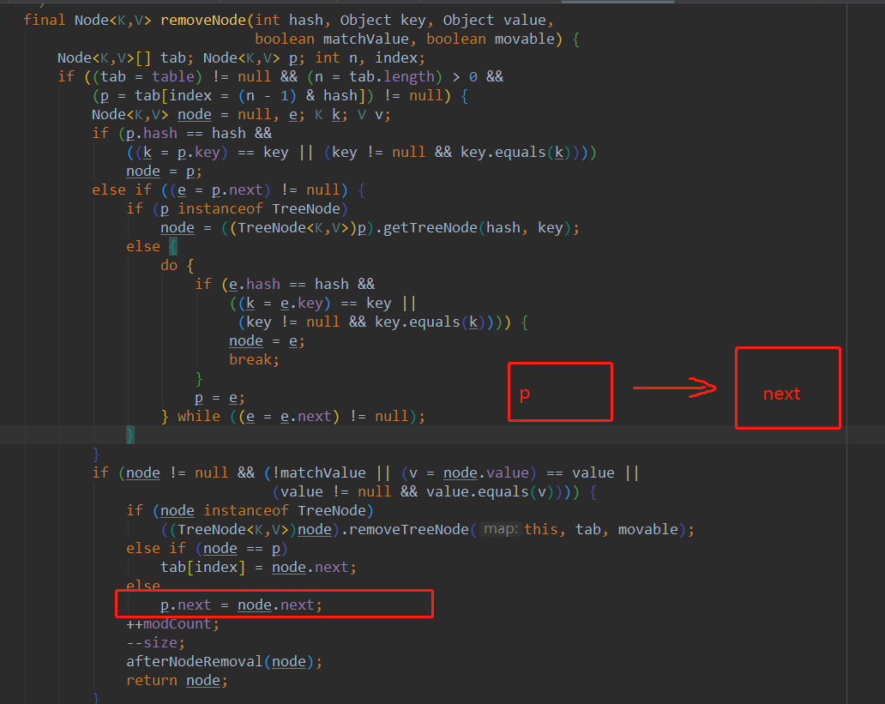
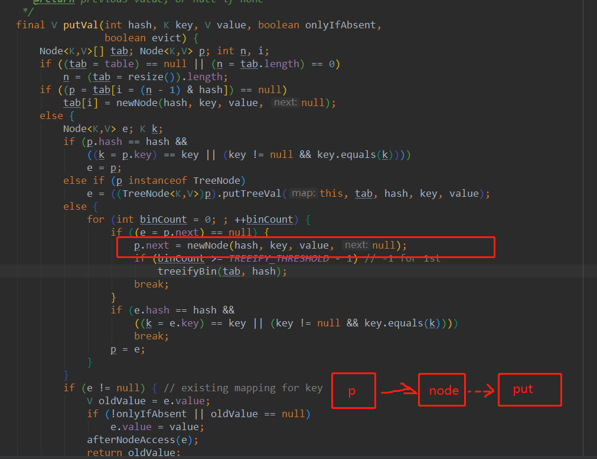

1.put,remove在非扩容情况下导致put丢失:

这是remove的代码

线程1即将把p.next设置为node.next(也就是null)
这是put的代码

线程2即将把node.next设置为一个新的Node

假如线程1,2同时执行到这里，然后线程1先执行完毕,那么这个链表上就会剩下p一个节点，
node节点后面再加一个新的节点也无济于事，因为他已经不属于这个链表了.

tips:如何测试?
可以使用idea的多线程断点调试，让两个线程分别卡在对应的部位，然后先执行一个线程