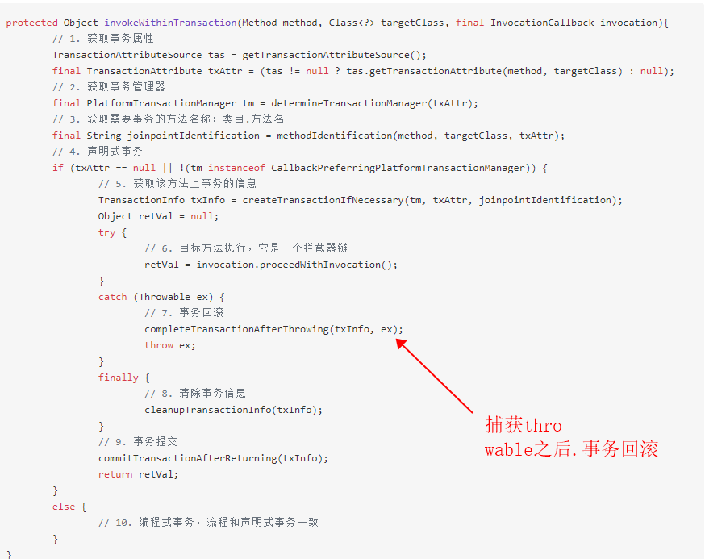

### 如何正确中断线程
* stop（已废弃）中断线程
    * 即刻抛出ThreadDeath(继承自Error)，在线程的run()方法内，任何一点都有可能抛出ThreadDeath Error，包括在catch或finally语句中。
        * 问:调用了stop之后 这个线程会继续执行代码吗
    * 会释放该线程所持有的所有的锁，而这种释放是不可控制的，非预期的。会破坏程序的原子性。
    * 问:正在进行spring事务操作的线程.被stop后事务怎么样了.
    
    
* interrupt 以我的理解 这个是一个通知，通知线程你应该中断了，阻塞会相应中断抛出异常.但是线程怎么处理，是由他自己去实现的
    * Thread里相关的Api
        * interrupted() static方法 返回当前线程的中断标志，并且清空标志 
        * interrupt()  调用之后，向对应线程发出一个中断的请求
        * isInterrupted() 返回线程的中断标志
        * throw InterruptException 阻塞方法响应中断。抛出异常，并且清空异常标志
    * 如果线程有中断的需求 就不能只捕获InterruptException异常而不做打印异常之外的操作，需要把中断的状态记录下来
        * 可以采取一个标志位(在方法体内)  或者  Thread.currentThread.interrupt() (传送给上层代码)重设标志;
        * 可以把InterruptException 传递到上层代码
    * 我们要找一个safePoint去正确响应中断，这个时候需要注意原子性等业务需求不受影响。
    * 不可取消的任务.如果中断后需要继续运行,而且继续运行的代码里面有阻塞方法,而我们其实是想执行完那个阻塞方法。那么这个时候是不应该立即使用Thread.currentThread.interrupt()传递状态的
    * 不响应中断的阻塞怎么办？
        * java.io包中的同步Socket I/O
        * java.io包中的同步I/O
        * Selector的异步I/O
        * 获取某个锁
    * 锁如何响应中断.lock.lockInterruptibly
* 哪些地方用到了interrupt? 
    * ThreadPoolExecutor的shutdownNow是对每个工作线程进行interrupt建议中断.(showdown则是等待工作线程执行完毕，两者均不再接受新的线程)
    * FutureTask的cancel里面用到了interrupt建议中断.
    * ......,结合以上,这些API的取消其实都是建议取消,而不是强制取消。不是你按了核按钮就世界核平，而是你按了核按钮经过组织同意才会世界核平。(中国派团赴梵签主教任命协议。神说要有光，经过党组织研究决定便有了光)

