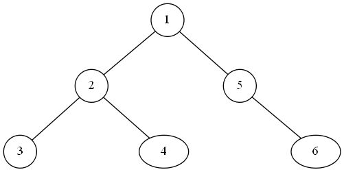

* 前序遍历
    * 访问根节点
    * 前序遍历左子树
    * 前序遍历右子树。
* 中序遍历
    * 中序遍历左子树
    * 访问根节点
    * 中序遍历右子树。
* 后序遍历
    * 后序遍历左子树
    * 后续遍历右子树
    * 访问根节点。
* 层序遍历
    * 访问根节点
    * 访问第二层节点
    * 访问第三层节点
    * 。。。。
 
 
 讲讲算法实现。
 讲一道经典的相关的题目:
 https://leetcode.com/problems/construct-binary-tree-from-preorder-and-inorder-traversal/