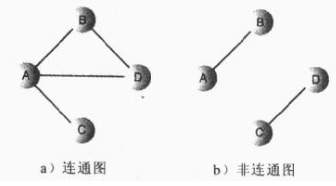

##什么是图？？？
图（Graph）是由顶点的集合和顶点之间边的集合组成
* 通常表示为
G（V,E)  ------V代表顶点,E代表边的集合.

这样的一个结构就是图了

1.连通图和非连通图
* 如果至少有一条路径可以连接起所有的顶点，那么这个图称作连通的；
* 如果假如存在从某个顶点不能到达另外一个顶点，则称为非连通的。

2.有权图，无权图。
* 在边上带有权重，比如时间或距离。
* 边之间可能还有权重. 应用:求两点最短距离(迪杰斯特拉算法)

3.有向图和无向图。
* 如果图中的边没有方向，可以从任意一边到达另一边，则称为无向图；比如双向高速公路，A城市到B城市可以开车从A驶向B，
也可以开车从B城市驶向A城市。
* 但是如果只能从A城市驶向B城市的图，那么则称为有向图。

如何用代码表达图?
用一个二维数组来表示节点之间是否链接,权重为多少

* DFS(DepthFirstSearch):深度优先搜索通过栈或者递归(简单一点)来实现 (沿着图的深度遍历图的节点)
//就是访问距离节点A直接相连的一个点B，然后再访问这个点B的下一个直接相连的点C........
    * 1:首先访问一个起始节点,压栈
    * 2:访问栈顶节点的第一个邻接的未访问顶点，然后压栈。完成后继续2。
    * 3:当栈顶节点无未访问邻接节点的时候,如果栈不为空，就从栈中弹出该顶点。
    * 4:如果栈为空,就完成了整个搜索过程。
* BFS(BreadthFirstSearch):广度优先搜索通过队列来实现,不同的实现机制导致不同的搜索方式。(辐射状向外扩散地搜索)
//就是先访问离节点A距离为1的所有点，然后再访问距离为2的所有点。。。。。。。。
    * 1:首先访问一个起始节点,入队列。
    * 2:取出队首的点,访问邻接未访问节点并加入队列。然后继续2操作。
    * 3:如果因为队列为空而不能，则搜索结束。